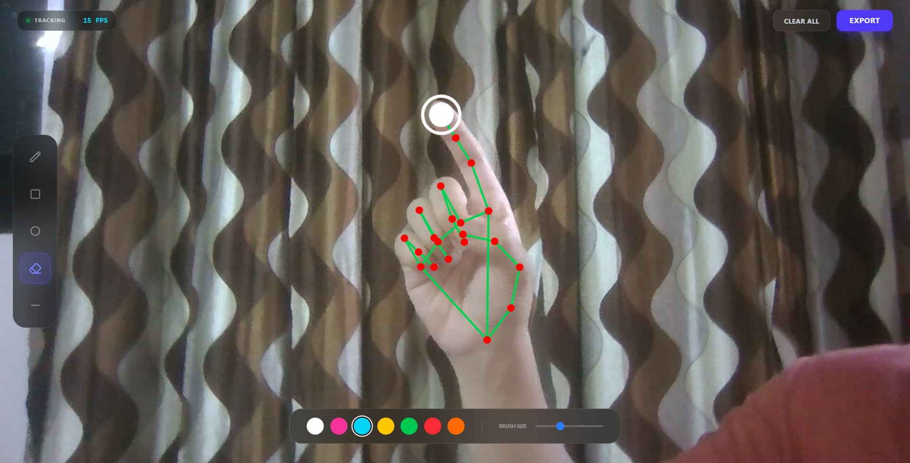
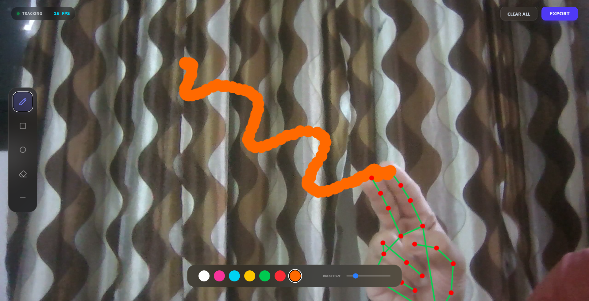
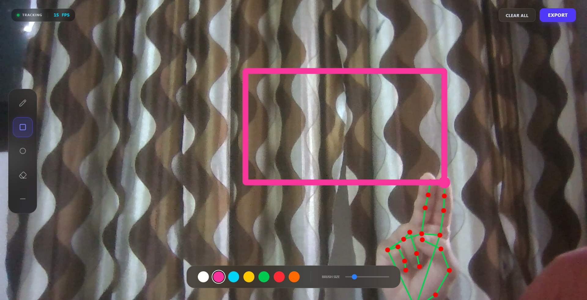
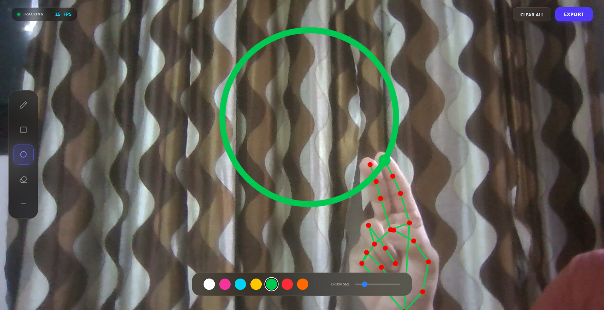
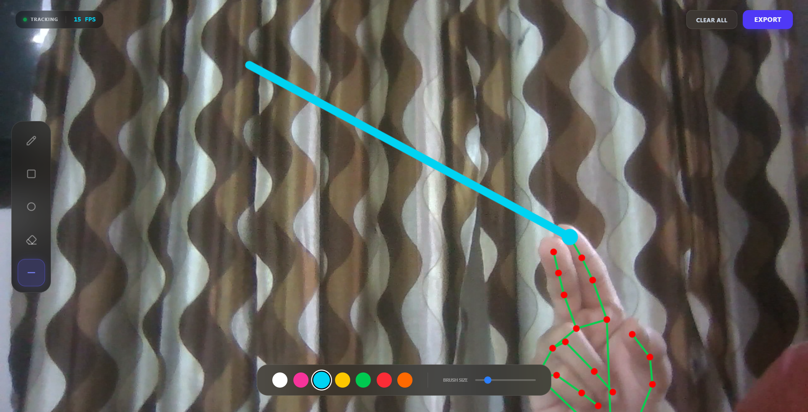
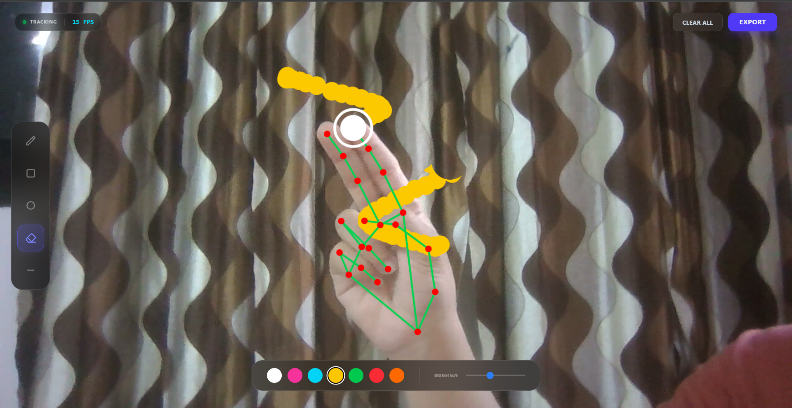
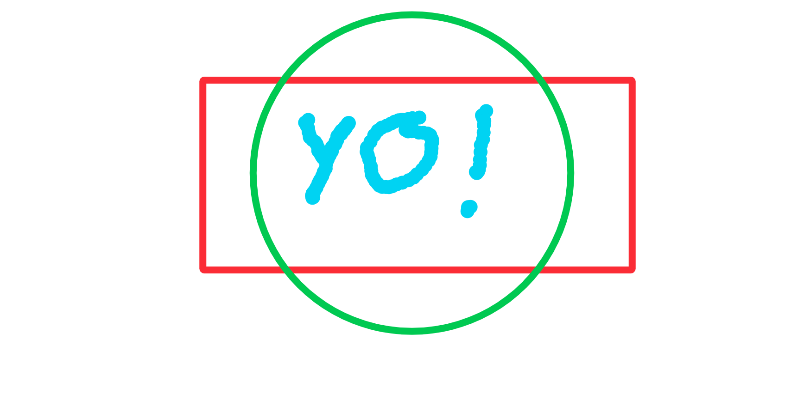

# 🎨 Air Brush App

Create digital art using hand gestures in real-time with your webcam!

- Web based conversion of the [Air Brush Python software](https://github.com/udham2511/air-brush)

🔗 **[Live Demo](https://udham2511.github.io/air-brush-app/)**

## 🎯 Features

- **Tool pane**l on the left.
- **Color** and **brush-size control bar** at the bottom.
- **FPS counter** at the top.
- **Clear All** and **Export** buttons sit in the top-right corner.

</img>

## 🎮 Quick Start

```bash
git clone https://github.com/udham2511/air-brush-app.git
cd air-brush-app
```

Then open `index.html` and allow camera access.

- Point your index finger at tool buttons
- Choose a color
- Raise middle finger to draw
- Raise pinky and move your index and thumb closer or farther to resize the brush
- Click Export to save your art

## 🛠️ Tool Gallery

<table style="width:100%; table-layout:fixed; border-collapse:collapse;">
  <tr>
    <td style="padding:8px; vertical-align:top; width:50%;">
      <h4>Pencil Tool</h4>
      </img>
    </td>
    <td style="padding:8px; vertical-align:top; width:50%;">
      <h4>Rectangle Tool</h4>
      </img>
    </td>
  </tr>

  <tr>
    <td style="padding:8px; vertical-align:top; width:50%;">
      <h4>Circle Tool</h4>
      </img>
    </td>
    <td style="padding:8px; vertical-align:top; width:50%;">
      <h4>Line Tool</h4>
      </img>
    </td>
  </tr>

  <tr>
    <td style="padding:8px; vertical-align:top; width:50%;">
      <h4>Eraser Tool</h4>
      </img>
    </td>
     <td style="padding:8px; vertical-align:top; width:100%;">
      <h4>Resize</h4>
      </img>
    </td>
  </tr>
</table>

## 🖼️ Output Preview

You can **download the result as a PNG** with the Export button.

</img>

## 🤝 Contributing

1. Fork it
2. Create a branch
3. Add your feature
4. Submit a PR

## 👤 Author

Made with 💻 and ☕ by [@udham2511]("https://www.github.com/udham2511")
